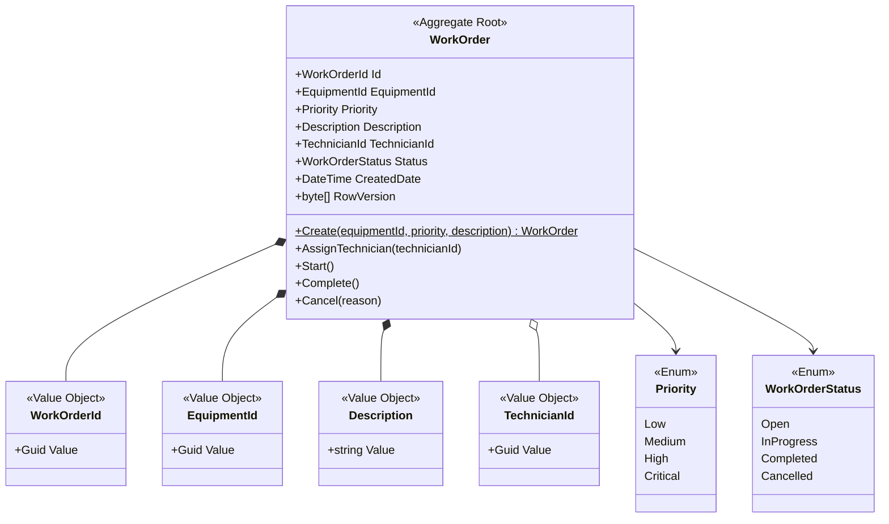
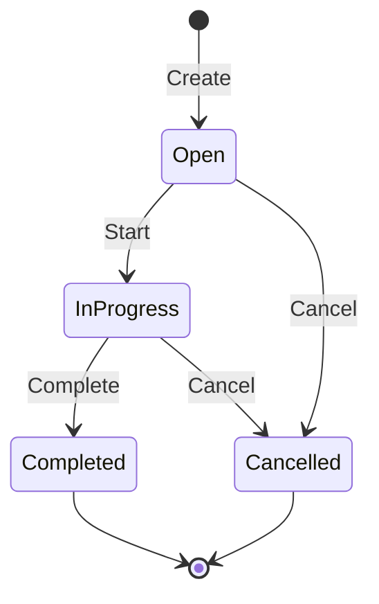

# Domain Model: Quản lý Phiếu công việc (Work Order)

> Tài liệu thiết kế đề xuất cho dự án
>
> Trạng thái: Bản thiết kế domain theo chuẩn Clean Architecture, CQRS và C# .NET 9.

## 1. Bối cảnh miền

### 1.1. Bối cảnh hiện tại của dự án

Dự án được phát triển theo kiến trúc Clean Architecture 4 lớp (Domain, Application, Infrastructure, Presentation/API) với công nghệ cốt lõi là C# .NET 9, Entity Framework Core (MySQL) và ReactJS.
Tài liệu này mô tả **domain model đề xuất** cho tính năng Quản lý Phiếu công việc (Work Order), tuân thủ nghiêm ngặt các quy tắc Domain-Driven Design (DDD) và kiến trúc dự án.

### 1.2. Bounded Context: Work Order Management

`Work Order Management` là bounded context chịu trách nhiệm quản lý vòng đời một phiếu công việc từ lúc tạo đến khi hoàn thành hoặc hủy. Context này quản lý:

- Identity và thông tin mô tả của Work Order.
- Thiết bị liên quan thông qua `EquipmentId`.
- Mức độ ưu tiên.
- Phân công kỹ thuật viên thông qua `TechnicianId`.
- Các chuyển đổi trạng thái hợp lệ.
- Domain events phát sinh từ các thay đổi quan trọng.

Context này **không tự động sở hữu** dữ liệu chi tiết của Equipment hoặc Technician. `EquipmentId` và `TechnicianId` được xem là các tham chiếu đến context/service khác.

### 1.3. Mục tiêu và phạm vi

**Mục tiêu:** Bảo đảm mọi Work Order luôn ở trạng thái hợp lệ và mọi thay đổi vòng đời đều đi qua các hành vi domain được kiểm soát (tránh Anemic Domain Model).

**Trong phạm vi:**
- Tạo Work Order.
- Gán hoặc thay đổi kỹ thuật viên khi được phép.
- Bắt đầu, hoàn thành hoặc hủy Work Order.
- Kiểm tra invariants và phát hành domain events.

**Ngoài phạm vi hiện tại:**
- Quản lý danh mục Equipment.
- Quản lý hồ sơ, lịch làm việc hoặc năng lực Technician.
- Tính giá, vật tư, thời gian công hoặc chi phí.
- Workflow phê duyệt nhiều cấp.

## 2. Mô hình domain tổng quát

### 2.1. Aggregate Root: `WorkOrder`

`WorkOrder` là Aggregate Root và là điểm vào duy nhất để thay đổi dữ liệu bên trong aggregate. Application layer không được tự sửa `Status`, `Priority` hoặc `TechnicianId` bằng setter công khai; thay vào đó phải gọi các hành vi domain (ví dụ: `Start()`, `Complete()`, `Cancel()` và `AssignTechnician()`).

**Identity:** `WorkOrderId` (Value Object).

**Thuộc tính đề xuất:**

| Thuộc tính | Kiểu (C#) | Ý nghĩa |
|---|---|---|
| `Id` | `WorkOrderId` | Định danh duy nhất của phiếu |
| `EquipmentId` | `EquipmentId` | Thiết bị cần xử lý |
| `Priority` | `Priority` | Mức độ ưu tiên |
| `Description` | `Description` | Nội dung công việc |
| `TechnicianId` | `TechnicianId?` | Kỹ thuật viên được phân công, có thể null khi tạo |
| `Status` | `WorkOrderStatus` | Trạng thái hiện tại |
| `CreatedDate` | `DateTime` | Thời điểm tạo (UTC) |
| `CreatedBy` | `string` | Người tạo (Audit) |
| `ModifiedDate` | `DateTime?` | Thời điểm cập nhật (UTC) |
| `ModifiedBy` | `string?` | Người cập nhật (Audit) |
| `RowVersion` | `byte[]` | Concurrency token cho Optimistic Locking |

### 2.2. Trách nhiệm của Aggregate Root

`WorkOrder` phải:
- Bảo vệ các invariants của chính nó.
- Từ chối các chuyển trạng thái không hợp lệ (ném ra Domain Exceptions).
- Kiểm soát thời điểm phân công hoặc thay đổi kỹ thuật viên.
- Ghi nhận các sự kiện Domain Events vào danh sách nội bộ để xuất bản sau khi lưu.
- Tuyệt đối **không phụ thuộc** trực tiếp vào EF Core, cơ sở dữ liệu hoặc framework bên ngoài.

### 2.3. Hành vi chính

| Hành vi | Điều kiện chính | Kết quả |
|---|---|---|
| `Create(...)` | Các trường bắt buộc hợp lệ | Tạo Work Order ở `Open` và thêm `WorkOrderCreatedDomainEvent` |
| `AssignTechnician(id)` | Chưa ở trạng thái kết thúc | Gán kỹ thuật viên và thêm `TechnicianAssignedDomainEvent` |
| `Start()` | Đang ở `Open`, đã có kỹ thuật viên | Chuyển sang `InProgress` và thêm `WorkOrderStartedDomainEvent` |
| `Complete()` | Đang ở `InProgress` | Chuyển sang `Completed` và thêm `WorkOrderCompletedDomainEvent` |
| `Cancel(reason)` | Chưa ở trạng thái kết thúc | Chuyển sang `Cancelled` và thêm `WorkOrderCancelledDomainEvent` |

## 3. Entity và Value Objects

### 3.1. Các Value Objects Identity
- **`WorkOrderId`**: Chứa một `Guid` định danh cho Work Order.
- **`EquipmentId`**: Chứa `Guid` tham chiếu đến thiết bị.
- **`TechnicianId`**: Chứa `Guid` tham chiếu đến thợ kỹ thuật.

*(Lưu ý: Tất cả Value Objects đều phải immutable và ghi đè Equals/GetHashCode).*

### 3.2. `Description` (Value Object)
Bao bọc mô tả công việc và chịu trách nhiệm chuẩn hóa/kiểm tra giá trị:
- Không được null hoặc rỗng sau khi trim.
- Giới hạn độ dài tối đa (ví dụ 2.000 ký tự).

### 3.3. Các Enums

```csharp
public enum Priority 
{
    Low,
    Medium,
    High,
    Critical
}

public enum WorkOrderStatus 
{
    Open,
    InProgress,
    Completed,
    Cancelled
}
```

## 4. Invariants và business rules

### 4.1. Invariants cốt lõi
1. `Id`, `EquipmentId`, `Priority` và `Description` phải có khi tạo Work Order.
2. Trạng thái khởi tạo luôn là `WorkOrderStatus.Open`.
3. Không được chuyển trạng thái ngược hoặc nhảy trạng thái không được cho phép.
4. `Completed` và `Cancelled` là các Terminal States (không có transition tiếp theo).
5. Phải sử dụng `DateTime.UtcNow` cho mọi thao tác ghi nhận thời gian.

### 4.2. Quy tắc chuyển trạng thái

| Trạng thái hiện tại | Hành động | Trạng thái mới | Hợp lệ |
|---|---|---|---|
| `Open` | `Start()` | `InProgress` | Có |
| `InProgress` | `Complete()` | `Completed` | Có |
| `Open` / `InProgress`| `Cancel()` | `Cancelled` | Có |
| `Completed` | Mọi hành động chuyển | Bất kỳ | Không (Ném DomainException) |
| `Cancelled` | Mọi hành động chuyển | Bất kỳ | Không (Ném DomainException) |

## 5. Domain Events

Khi thực hiện hành vi, `WorkOrder` sẽ lưu lại các Events triển khai giao diện `INotification` (MediatR) để Application Layer dispatch.

| Event | Dữ liệu tối thiểu |
|---|---|
| `WorkOrderCreatedDomainEvent` | `WorkOrderId`, `EquipmentId`, `Priority`, `OccurredOn` |
| `TechnicianAssignedDomainEvent` | `WorkOrderId`, `TechnicianId`, `OccurredOn` |
| `WorkOrderStartedDomainEvent` | `WorkOrderId`, `OccurredOn` |
| `WorkOrderCompletedDomainEvent` | `WorkOrderId`, `OccurredOn` |
| `WorkOrderCancelledDomainEvent` | `WorkOrderId`, `Reason`, `OccurredOn` |

## 6. Sơ đồ domain



## 7. Sơ đồ chuyển đổi trạng thái



## 8. Mapping kiến trúc vào C# .NET 9 Clean Architecture

| Thành phần DDD | Lớp tương ứng | Ghi chú theo Rules |
|---|---|---|
| Aggregate Root, Value Objects, Enums, Domain Events | **Domain Layer** | Tuyệt đối không dùng EF Core. Entity chỉ chứa behavior, không phải "Anemic Models". |
| Use Cases, CQRS, Interfaces | **Application Layer** | Sử dụng MediatR Commands/Queries. Dùng FluentValidation (ValidationBehavior), TransactionBehavior cho Commands. |
| DB Context, EF Core, Services | **Infrastructure Layer** | Triển khai MySQL với `AsNoTracking()` cho queries, Outbox pattern cho events, phân trang Keyset/Cursor cho Queries lớn. |
| API Endpoints | **Presentation/API** | Controller siêu mỏng, chỉ dispatch MediatR. Áp dụng Global Exception Handler. Trả về DTO thay vì Entity. |
